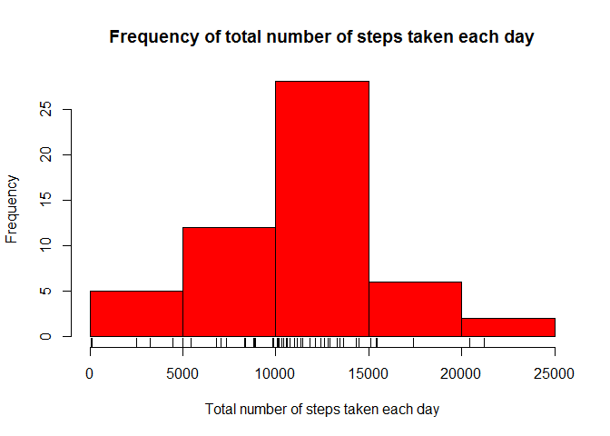
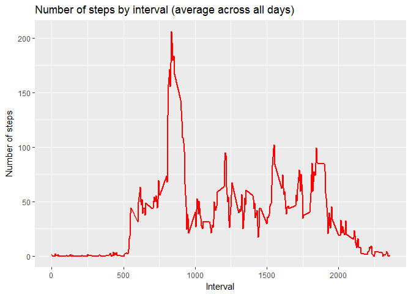
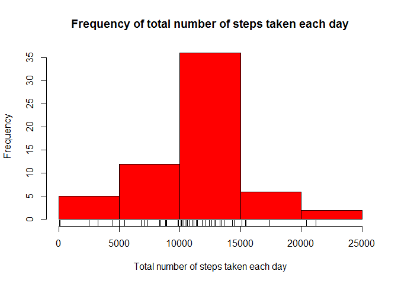
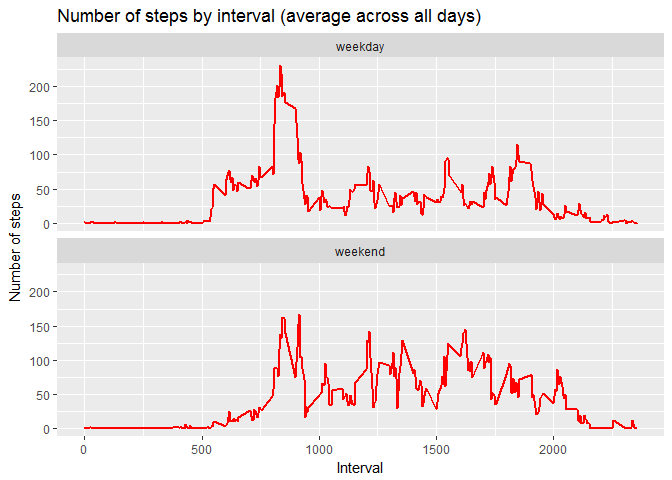

# Reproducible Research: Peer Assessment 1

## Loading and preprocessing the data

Code for loading and preprocessing the data

```r
dfActivityRaw <- read.csv("activity.csv")
dfActivity <- dfActivityRaw[!is.na(dfActivityRaw$steps), ]
```


## What is mean total number of steps taken per day?

Code for making a Histogram of mean total number of steps taken per day:


```r
dfActivityDay <- aggregate(steps ~ date, data = dfActivity, sum, na.rm = TRUE)
hist(dfActivityDay$steps, main="Frequency of total number of steps taken each day", xlab = "Total number of steps taken each day", ylab = "Frequency", col="red")
rug(dfActivityDay$steps)
```

<!-- -->


Code for calculating and reporting the mean and median of the total number of steps taken per day:


```r
stepsMean <- mean(dfActivityDay$steps, na.rm = TRUE)
stepsMean
```

```
## [1] 10766.19
```

```r
stepsMedian <- median(dfActivityDay$steps, na.rm = TRUE)
stepsMedian
```

```
## [1] 10765
```


## What is the average daily activity pattern?

Code for making a time series plot of average number of steps taken, averaged across all days:


```r
dfActivityInterval <- aggregate(steps ~ interval, data = dfActivity, mean, na.rm = TRUE)

library(ggplot2)
```

```
## Warning: package 'ggplot2' was built under R version 3.3.3
```

```r
ggplot(dfActivityInterval, aes(interval, steps)) +
        geom_line(colour = "red", lwd = 1) +
        ggtitle("Number of steps by interval (average across all days)") +
        xlab("Interval") +
        ylab("Number of steps")
```

<!-- -->

Code for calculating which 5-minute interval, on average across all the days in the dataset, contains the maximum number of steps:


```r
dfActivityInterval$interval[which.max(dfActivityInterval$steps)]
```

```
## [1] 835
```


## Imputing missing values


Code for filling in missing values (NA) for "steps" with mean value of "steps" accross all days for that 5-minute interval:


```r
dfActivityFilled <- dfActivityRaw

numberOfstepsNA <- length(which(is.na(dfActivityFilled$steps)))
stepsNA <- which(is.na(dfActivityFilled$steps))


for (i in 1:numberOfstepsNA) {

        numberOfRow <- stepsNA[i]
        numberOfInterval <- dfActivityFilled$interval[numberOfRow]
        meanStepsForInterval <- dfActivityInterval$steps[dfActivityInterval$interval == numberOfInterval]
        dfActivityFilled$steps[numberOfRow] <- meanStepsForInterval
        
}
```

Code for making a histogram of the total number of steps taken each day (with the missing data filled in):


```r
dfActivityFilledDay <- aggregate(steps ~ date, data = dfActivityFilled, sum, na.rm = TRUE)
hist(dfActivityFilledDay$steps, main="Frequency of total number of steps taken each day", xlab = "Total number of steps taken each day", ylab = "Frequency", col="red")
rug(dfActivityFilledDay$steps)
```

<!-- -->

Code for calculating and reporting the mean and median total number of steps taken per day (with the missing data filled in):


```r
stepsFilledMean <- mean(dfActivityFilledDay$steps, na.rm = TRUE)
stepsFilledMean
```

```
## [1] 10766.19
```

```r
stepsFilledMedian <- median(dfActivityFilledDay$steps, na.rm = TRUE)
stepsFilledMedian
```

```
## [1] 10766.19
```

```r
meanDiffPerc <- round(100*(stepsMean - stepsFilledMean)/ stepsMean, 4)
medianDiffPerc <- round(100*(stepsMedian - stepsFilledMedian)/ stepsMean, 4)
```

Code for evaluating the mean and median total number of steps taken per day (with the missing data filled in):


```r
meanDiffPerc <- round(100*(stepsMean - stepsFilledMean)/ stepsMean, 4)
meanDiffPerc
```

```
## [1] 0
```

```r
medianDiffPerc <- round(100*(stepsMedian - stepsFilledMedian)/ stepsMean, 4)
medianDiffPerc
```

```
## [1] -0.011
```

The variation of the mean and the median after imputing the missing values are respectively 0% and -0.011% which can be considered as small difference for this sample.

## Are there differences in activity patterns between weekdays and weekends?

Code for creating a new factor variable in the dataset with 2 levels - "weekend" and "weekday":


```r
dfActivityFilled$date <- as.Date(dfActivityFilled$date, format = "%Y-%m-%d")
dfActivityFilled$day <-  factor(ifelse(weekdays(dfActivityFilled$date) %in% c("Saturday", "Sunday"), "weekend", "weekday"))
```

Code for making a time series plot of average number of steps taken, averaged across all weekday days or weekend days:


```r
dfActivityFilledInterval <- aggregate(steps ~ interval + day, data = dfActivityFilled, mean, na.rm = TRUE)
ggplot(dfActivityFilledInterval, aes(interval, steps)) +
        geom_line(colour = "red", lwd = 1) +
        facet_wrap(~day, ncol = 1) +
        ggtitle("Number of steps by interval (average across all days)") +
        xlab("Interval") +
        ylab("Number of steps")
```

<!-- -->


